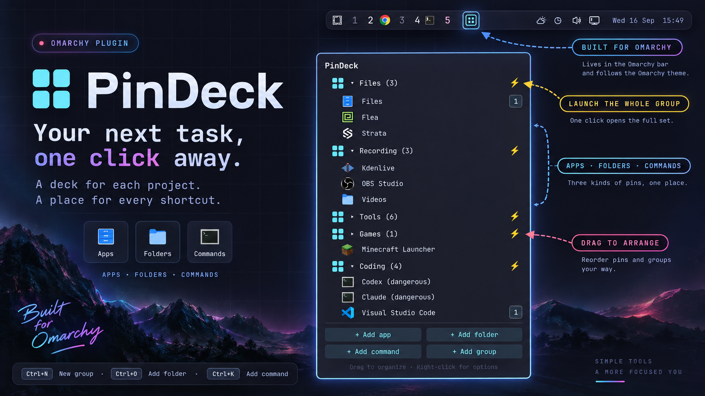

# PinDeck

**Your whole setup. One click.**

Pin your apps and folders, write your own custom commands, and group them by project in your Omarchy bar. Press a group’s ⚡ button to open every app and folder and run every command. Set it up once. Get straight to work.



## Three kinds of pins, one place

**Apps.** Click **Add app**, fuzzy-search your installed applications, and pin one. GUI and terminal apps are both supported. An app's own actions—such as opening a private browser window—are available through its right-click menu and small numbered buttons. Hover a button to see what it does.

**Folders.** Click **Add folder** and choose a directory. Home, Downloads, a deep project directory: each becomes a shortcut that opens in your default file manager. Give it a useful name; hover to see the full path.

**Commands.** Click **Add command**, give it a name, and save the command you want to run. For example, **List downloads**:

```sh
eza -a -l ~/Downloads
```

Commands run using Bash, starting from your home directory. `~`, variables, pipes, and redirects work.

- **Run in terminal checked** (the default): opens your configured terminal, shows the command's exit status, and waits for Enter when finished.
- **Run in terminal unchecked**: runs the command without opening an extra terminal or waiting for Enter. Use this for graphical commands or scripts that open their own window, such as `~/Scripts/herdr-void` if you have that script installed.

Set the checkbox when creating a command, or right-click an existing command and choose **Edit command** to change it. Editing restores the saved setting; cancelling leaves it unchanged. Group launches respect each command's setting.

Commands that run in a terminal show a small `>_` indicator at the right of their row. Hover over it for **Runs in terminal**, styled like the other tooltips. Hover over the command name to see the saved command text. Clicking the indicator launches the command just like clicking its name.

## Arrange it your way

- **Create groups** with **Add group**. Right-click a group to add apps, folders, or commands directly inside it.
- **Drag to reorder** pins and groups. Drop a pin onto a group's center to move it inside, or onto the bottom drop area to move it back to the top level.
- **Reuse your favorites.** The same app or folder can appear in several groups, plus once at the top level. Each copy has its own position; folder copies can have different names.
- **Change things in place.** Right-click to move or unpin an item, rename a folder shortcut, or edit a command. Removing one copy leaves the others alone.
- **Delete a group and its pins.** Copies at the top level or in other groups remain. The underlying apps and files are unaffected.

Groups use a four-square grid icon, folders use folder icons, and commands use terminal icons. The panel follows your Omarchy theme and keeps the layout compact.

## Install

```sh
omarchy plugin add https://github.com/chyld/omarchy-pindeck.git --enable
```

Click the four-tile icon in your bar, add your first few items, and make a group when you are ready.

PinDeck requires Omarchy Quattro, Python 3, PyGObject (`python-gobject`), GTK 4, GdkPixbuf, Bash, `uwsm-app`, `gtk-launch`, `xdg-terminal-exec`, `xdg-open`, and `notify-send`. Programs used in your saved commands must be installed separately.

## Keyboard controls

| Key | Action |
| --- | --- |
| ↑ / ↓ | Select an item |
| Enter | Open, pin, or expand the selected item |
| Escape | Go back, cancel a drag, or close the panel |
| Menu / Shift+F10 | Open the selected item's actions |
| Ctrl+N | Create a group |
| Ctrl+O | Add a folder shortcut |
| Ctrl+K | Add a command |

To open PinDeck from a keybinding or another tool:

```sh
omarchy-shell shell summon chyld.pindeck '{}'
```

## Your configuration is yours

Everything you arrange is stored in:

```text
~/.config/omarchy/pindeck.json
```

Manage your pins and groups through the panel. Valid external configuration changes reload automatically. If an edit is invalid, PinDeck displays an error and keeps the last valid data visible instead of replacing your setup.

Deleting `pindeck.json` while PinDeck is running resets the panel and recreates the file with empty pins and groups.

The file is plain JSON: `pinnedApps` holds your pins, `folders` holds your groups, and `rootOrder` records their top-level order. Stable `pinId` and `folderId` values connect the pieces; `version` is currently `1`. Directory shortcuts use `kind: "location"` with an absolute `path`; commands use `kind: "command"` with `commandText`.

For command pins, `runInTerminal: true` enables the terminal wrapper and `runInTerminal: false` disables it. Older commands without this field continue to run in a terminal. The display `name` is only a label; put arguments in `commandText`.

Existing `pinned.json` data is imported when `pindeck.json` does not yet exist. The old file remains as a backup. You can copy your configuration between machines; matching apps and command dependencies need to be installed there too.

## What it does to your system

PinDeck runs inside the Omarchy shell. It reads installed desktop entries and saves its configuration through a supervised Python helper with bounded reads and atomic writes. It creates the config on first use, importing older settings when available. Opening the panel does not launch your pins; you choose when an item or group runs.

- **App launches** use `uwsm-app` and `gtk-launch`; terminal launches use `xdg-terminal-exec`.
- **Command launches** use a runner that checks the saved pin and configuration revision before passing the command to Bash. With **Run in terminal** unchecked, it skips `xdg-terminal-exec` and returns the command's exit status without a close prompt.
- **Folder shortcuts** use a native chooser and open through `xdg-open`. An unavailable folder reports an error without stopping the remaining group launches.
- **Focus** follows a matching launched window, with the pointer moved to its center. Group launches track the final app or folder manager.
- **Network and credentials:** PinDeck fetches no remote data and has no credential store. Saved commands are plain text. The apps and commands you launch run with your user permissions and may access files, credentials, or the network as those programs normally do.
- **Configuration:** PinDeck writes `~/.config/omarchy/pindeck.json` and a private `.pindeck.lock` alongside it. New configuration writes use mode `0600`; compatible older `0644` files become private on the next save. It does not install dependencies or add startup commands.

## Remove

```sh
omarchy plugin remove chyld.pindeck
```

Your `pindeck.json`, any legacy `pinned.json`, and `.pindeck.lock` remain for a future reinstall. Temporary helpers and the configuration watcher stop with the plugin. Apps and commands already launched continue running.

## Development

The root `manifest.json`, `BarWidget.qml`, and `Service.qml` are the plugin entry points. The shared service coordinates configuration across monitors. `ui/` contains views, `controllers/` contains interaction and launch coordination, `domain/` contains pure JavaScript logic, and `backend/` contains bounded filesystem and helper operations.

```sh
python3 scripts/test.py
python3 scripts/test_mutations.py
python3 scripts/test_coverage.py
# On an Omarchy desktop, using an isolated configuration:
python3 scripts/test_runtime.py
```

Qt 6 QML Test, Quick, and Controls modules are needed for component tests. See [testing](docs/TESTING.md) and [security boundaries](docs/SECURITY.md).

Tests cover both command launch modes, exit status and stale-configuration rejection, checkbox mouse and keyboard interaction, indicator visibility, tooltip hover and dismissal, and clicks through the indicator. Runtime integration also checks creating and editing terminal settings, cancelling edits, and defaults for older commands. Run `python3 scripts/test.py --runtime` to include that integration check with the main suite.

After local UI changes, restart the shell with `omarchy restart shell` if it still displays the previous code.

Desktop checks should also cover loading, keyboard and pointer interactions, launches, config edits, shell reloads, and multiple monitors. Portable tests alone do not verify those behaviors.

## License

[MIT](LICENSE) · Chyld Medford
